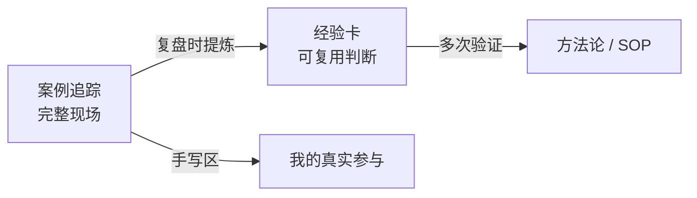

# 实战案例追踪

> [!tip] 为什么单设这一区
> 经验卡是"提炼后的结论"，这里是"带血的现场"。每个 Issue 按 [[foundations/ai-coding-workflow|8 站流水线]] 留痕，复盘时不用翻聊天记录找证据。

## 与经验卡的关系

模板：[[templates/case-tracking|Issue 全流程跟踪单]]。

## 进行中的案例

| 案例 | 当前站 | 已印证的经验卡 |
| --- | --- | --- |
| [[cases/issue-176-task-detail-layout\|#176 任务详情首屏信息架构]] | 站 4 · Coding | [[AC-004-confirm-branch-first\|AC-004]]（开工当天就发生了分支/路径误写） |
| [[cases/issue-194-member-core-flow\|#194 评级→草稿→显式生成任务]] | 站 8 · 验收 | 对照组：需求合同写细 + 独立审查闭环（第一轮拦下 4 个 P1） |
