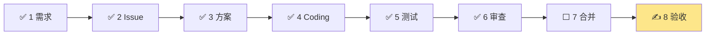

# 案例 #194｜评级→计划草稿→显式生成任务

> [!important] 本页怎么填写（浏览器里就能写）
> 1. 点 → [✏️ 编辑本页](https://github.com/yinhui198456/ai-coding-playbook/edit/v5/content/cases/issue-194-member-core-flow.md)（GitHub 网页编辑器，自带预览）；
> 2. `Ctrl+F` 搜「✍️」，把答案写在 `＿＿＿` 横线上；
> 3. 点绿色 **Commit changes** 保存，1~2 分钟后线上页面自动更新。

**Issue**：[#194](https://github.com/yinhui198456/team-capability-platform/issues/194)（Pilot · 核心流 · P0）｜ **PR**：[Draft #195](https://github.com/yinhui198456/team-capability-platform/pull/195) ｜ **当前站**：8/8 验收



> 图例：✅ 已完成 ｜ ✍️ 黄色 = 等我来填 ｜ ⬜ 还没到

## ✍️ 我要填的汇总

| 站 | 要填什么 | 一句话采集方式 |
| --- | --- | --- |
| 1 | 业务确认（日期+方式） | 看原型图 + 读"一句话说人话" |
| 3 | 确认 AI 做的 3 个决定 | 逐条标"同意 / 改" |
| 7 | PR base + 终态七项 | 打开 PR #195 亲眼看 |
| 8 | 真实 Chrome 9 条逐条打勾 | 测试环境登录操作 |
| 末 | 我的复盘 | 手写 |

> [!note]- 本页黑话速查（看不懂的词先点这里）
> - **L3 能力**：能力地图第三级，最细颗粒度的能力项（如"能用 AI 写 SQL"）
> - **Gap**：当前级别和目标级别的差距
> - **幂等**：同一操作重复执行多次，效果和执行一次一样（重复点击不会重复建任务）
> - **零写入**：非法操作完全不碰数据库，连一半都不写
> - **红测→绿测**：先写一个注定失败的测试，证明"旧代码确实没这功能"（红），再写代码让它通过（绿）
> - **Draft PR**：草稿 PR，不能合并，用于提前展示和检查
> - **410**：HTTP 状态码"已永久删除"，这里用来让退役的旧接口稳定拒绝写入

---

## 各站记录

### 站 1 · 需求 ✅

**一句话说人话**：这是 [#187](https://github.com/yinhui198456/team-capability-platform/issues/187) 已定版故事线的**第一个纵向试点**——让 Member 在测试环境走完一段完整业务闭环：给部分能力评级 → 把想提升的放进计划草稿 → 补月份 → **手动点**"生成所选学习任务" → 在年度计划和任务列表看到正式任务。全程可中途保存、刷新不丢、非法操作零写入。

**要做什么**（Issue"用户可见结果"的人话版）：

1. 评级可以只评一部分就保存，没评的不拦着；
2. 有差距的 L3 可以加入/移出计划草稿，**刷新、退出、重新登录后草稿还在**；
3. 月份只填 `YYYY-MM`，点输入框任意位置都能打开年月选择器；
4. 只有点"生成所选学习任务"才真正生成，缺信息就整批不生成+中文提示哪项缺什么；
5. 生成成功后，不用刷新就能在年度计划/学习任务入口看到结果。

**不做什么**（非范围精选，碰了算越界）：不重做任务执行页（M05）、不动 Evidence 流程、不做看板和分析页、**不动测试环境业务数据**、不合并不发布。

**怎么算成功**：站 2 的验收单（自动检查 4 条 + 真实 Chrome 9 条）。

**先看原型图，再看字**：


- 🖥️ [M02 能力评级 · 在线交互原型](https://yinhui198456.github.io/team-capability-platform/assets/ui-prototypes/prototype-v1/index.html?collection=selected&page=M02)（本 Issue 主战场）
- 📚 [故事线确认稿](https://yinhui198456.github.io/team-capability-platform/assets/ui-prototypes/prototype-v1/storyline-v1.html)（#187 定版）

> [!todo] ✍️ 待我确认（就一件事：这条核心流是你要的吗？）
> 1. 看原型图和 M02 在线原型——"评级→草稿→手动生成"这条流水线，是不是你要的样子；
> 2. 特别留意：**生成是手动点按钮才发生**，不是评完级自动出现任务；
> 3. 哪里不对 → 在 [#194 评论](https://github.com/yinhui198456/team-capability-platform/issues/194)里写明。
>
> **我的确认（日期 + 方式）：**＿＿＿＿＿＿

> [!example]- 业务合同关键条款原文（想知道"细到什么程度"再展开）
> > 保存评级、维护计划草稿、生成正式任务是三个独立动作。`current_level=0` 是已评级，不得按空值处理。
>
> > 任一所选项非法时整批零生成、零复用、零部分写入；页面定位具体 L3 并说明处理方法。
>
> > 新流程不创建新的 Assessment Review，不进入 Buddy 自评复核队列……历史 Assessment Review 只读保留，不迁移、不回填、不删除。
>
> —— [#194 业务合同](https://github.com/yinhui198456/team-capability-platform/issues/194)。**这就是"需求三件套"的完全体**：不仅有要做什么/不做什么/成功标准，还把每个业务规则的边界写死了。

### 站 2 · Issue 任务单 ✅（AI 已整理）

需求细节在站 1，这里只管"这张任务单怎么派"：

| 属性 | 内容 |
| --- | --- |
| 类型 / 优先级 | 纵向试点（Pilot）· 核心流 · **P0** |
| 页面 / 角色 | Member 主战场 [M02 `/capability/assessment`；M03/M04 只做"最小承接"](https://github.com/yinhui198456/team-capability-platform/blob/master/docs/04_UI.md)（§4.9） |
| 协作模式 | 模式 B+E：Codex CLI 总控持 Goal/Plan，CC 唯一写代码，只读 Agent 分析，[夜间静默授权](https://github.com/yinhui198456/team-capability-platform/issues/194#issuecomment-5317173700) |
| 关联 Issue | #178 暂停（合同已吸收进本 Issue）；PR #193 不自动合并；#192 是部署准入依赖 |
| 验收标准 | 自动检查 4 条（站 5/6 已覆盖）+ 下面真实 Chrome 9 条（站 8 照做） |

**真实 Chrome 验收 9 条 → 可操作检查单**（站 8 照这个做，在测试环境用测试身份操作）：

| # | 验收点 | 怎么操作 | 结果 |
| --- | --- | --- | --- |
| 1 | 部分评级保存不生成任务 | 只给 2~3 个 L3 评级 → 保存 → 去看年度计划，**不该出现**任何新任务 | ⬜ |
| 2 | 草稿可恢复 | 加入几个 L3 到提升计划 → 按 F5 刷新 → 退出重登 → 选择和输入都还在？ | ⬜ |
| 3 | 年月选择器好用 | 点月份输入框的**任意位置**（不只是图标），能打开选择器并保存 `2026-09` 这种格式？ | ⬜ |
| 4 | 缺月份零写入 | 故意不填月份 → 点生成 → 什么都没生成，页面用中文指出具体哪个 L3 缺月份？ | ⬜ |
| 5 | 显式生成+不重复 | 选 1 个 L3 生成一次；再选多个生成一次；对同一批**连续点两次** → 任务数不翻倍？ | ⬜ |
| 6 | M03/M04 看得到结果 | 生成后直接去年度成长计划和学习任务入口，不用刷新就能看到？ | ⬜ |
| 7 | Buddy 无新复核待办 | 换 Buddy 身份登录，没有新的自评复核待办，Evidence Review 入口还在？ | ⬜ |
| 8 | 三种宽度可用 | 1440 和 1024 下字段不遮挡；768 下能完成评级+生成核心操作？ | ⬜ |
| 9 | 状态一致 | 操作中途按 F5、点浏览器返回、退出重登，页面状态都不乱？ | ⬜ |

### 站 3 · 方案 ✅（与实际实现一致）

方案体现在 [PR #195](https://github.com/yinhui198456/team-capability-platform/pull/195)（共 61 个文件，+2947/−3257 行）的两个提交，原文引用：

> 三独立动作：保存能力评级 / 加入-移出计划草稿 / 显式生成所选学习任务。仅显式生成写入 plan_item/learning_task；plan_month=YYYY-MM 为唯一时间输入。/submit 退役……历史评估只读。
> —— [commit 7af8a16](https://github.com/yinhui198456/team-capability-platform/commit/7af8a16b8627d583bdc3c8638619890d4b56ee2c)（主体实现，54 个文件）

> P1-1 缺月仍可生成：客户端预检零请求列出 L3 并定位首项，不再禁用按钮……P1-3 Buddy 自评复核退役……review POST 稳定 410 零写入……P1-4 generate-plan-items 消费 Idempotency-Key……并发同 key 单次写入。
> —— [commit 6586ed0](https://github.com/yinhui198456/team-capability-platform/commit/6586ed0b55b8baa8b630f8fff4673872ab7e1074)（评审修复，25 个文件）

**这次需求合同写得极细**（站 1 折叠区有原文），方案基本是照合同实现，AI 自由发挥的空间很小。

> [!todo] ✍️ 待我逐条确认：AI 做的 3 个决定
> 合同虽细，仍有几处实现决策值得我过目（都翻成了人话）：
>
> | # | AI 的决定 | 人话解释 | 我的决定（同意/改成什么） |
> | --- | --- | --- | --- |
> | 1 | 旧的"Buddy 复核"功能彻底关闭 | 旧入口访问会直接收到"已永久关闭"的回复，而不是留着只是禁用——更干净，但没有回头路 | ＿＿＿ |
> | 2 | 一批浏览器自动化测试这轮先不修 | 它们还在检查"已经关闭的旧页面"，所以一直报错；留着以后统一改，代价是这批测试暂时一直是红的 | ＿＿＿ |
> | 3 | 代码风格检查的老问题不顺手修 | 那些问题是仓库里早就有的，不是这次改出来的；顺手修会让这次改动变大变乱 | ＿＿＿ |
>
> 确认方法：看上表想 30 秒，拿不准的点 commit 链接看改动。有不同意的 → 在 #194 评论写明。

### 站 4 · Coding ✅（AI 已整理）

**改了哪些文件、各是干什么的**（[PR #195 全部 61 个文件](https://github.com/yinhui198456/team-capability-platform/pull/195/files)，按用途归类）：

| 目录 | 文件数 | 用途（人话） |
| --- | --- | --- |
| `backend/app/assessment` | 2 | 后端·评级相关接口 |
| `backend/app/planning` | 3 | 后端·计划生成逻辑（点"生成"按钮后跑的代码） |
| `backend/app/migrations` | 2 | 数据库搬家脚本：把月份字段从数字改成 `YYYY-MM` 文本 |
| `backend/app/access` | 1 | 后端·权限（谁能看/操作什么） |
| `backend/tests` | 34 | 后端测试（大头在这，新合同全靠它们锁死） |
| `frontend/src` | 18+1 | 前端页面：M02 评级页三动作、M03 计划列表 |
| `frontend/tests/e2e` | 13+25 | 浏览器自动化测试 + 截图基线（旧 Buddy 复核页删除，其截图基线随之删除） |

**执行现场**：

- 分支 `feat/issue-194-member-core-flow`（从 master 创建）✅
- 写入者：CC（Claude Code），本轮模型首选 **Kimi**；只有连续两次额度/限流故障才允许换一次 DeepSeek（[夜间授权原文](https://github.com/yinhui198456/team-capability-platform/issues/194#issuecomment-5317173700)）
- 总控：Ubuntu 服务器 tmux 会话里的 Codex CLI（持有 Goal/Plan，不写代码）

> [!todo] ✍️ 待我补充（不知道就问 AI，把答案贴上来）
> 1. 本次实施的 worktree 目录名是？（问总控："#194 的 worktree 路径是什么"）
> 2. 本会话 CC 的 token 用量 / 会话时长？（问 CC："报告本会话 token 用量"）
>
> **记录：**＿＿＿＿＿＿

### 站 5 · 测试 ✅（证据在案）

**测试方法和工具**（[交付证据评论](https://github.com/yinhui198456/team-capability-platform/issues/194#issuecomment-5319483358)，精确到 SHA、单次串行无重跑）：

| 层 | 工具 | 测什么 | 结果 | 耗时 |
| --- | --- | --- | --- | --- |
| 后端单元/集成 | pytest（Python 测试框架） | 接口逻辑、数据库写入、权限 | 743 → 749 passed | 17 分 47 秒 |
| 后端风格 | ruff + black | 代码风格、格式 | 零新增问题 | 秒级 |
| 前端单元 | Vitest | 组件渲染、交互逻辑 | 286 → 272 passed | — |
| 前端风格 | eslint | 代码风格 | 0 errors | — |

**为本 Issue 新写的测试，测了什么、预期如何**（[commit 6586ed0](https://github.com/yinhui198456/team-capability-platform/commit/6586ed0b55b8baa8b630f8fff4673872ab7e1074) 提交信息原文列举）：

| 测试 | 预期 | 结果 |
| --- | --- | --- |
| 混合选择零写入 | 选的 L3 里有一个缺月份 → 整批一个都不生成 | ✅ |
| 同键重放 / 异载荷冲突 | 同一次生成请求重复发 → 返回首次结果不重复建；同 key 内容变了 → 拒绝（409） | ✅ |
| 并发单写 | 两个相同请求同时到 → 只写一次 | ✅ |
| M03 月份筛选展示 | 新生成项按 `YYYY-MM` 正确显示和筛选 | ✅ |
| Buddy 路由 / review POST 退役 | 旧复核入口跳走、旧接口稳定拒绝写入（410） | ✅ |

**红测→绿测**：先在 master 上跑新测试确认**失败**（证明旧代码真没这功能），实现后再跑**通过**。4 组旧合同断言族均为"修复前红、修复后绿"，没删没跳任何测试。

> [!question] 为什么没有"模拟真人操作 Chrome"的测试截图？
> 问得好——那类测试叫 E2E（端到端），TCP 用 Playwright 跑。**这轮它恰恰是唯一红的**：一批旧 E2E 用例还在检查"已关闭的 Buddy 复核页"，所以一直失败（这就是站 3 决定 2 留下的尾巴）。真人 Chrome 测试自动化替代不了——就是站 8 等你做的验收。

> [!note] GitHub 上反复出现的 Actions 是什么？
> 你看到的 [Actions 运行](https://github.com/yinhui198456/team-capability-platform/actions/runs/32124510046)是 **CI（持续集成）**：每次 push 代码，GitHub 自动跑三道门禁——`Backend Quality Gate`（后端检查+测试）、`Frontend Quality Gate`（前端检查+测试）、`E2E Tests`（浏览器自动化）。**不用人点，push 就触发**，结果直接挂在 PR 的 checks 里（见站 6）。它和站 5 的关系：站 5 是 AI 在自己机器上跑测试的报告，CI 是 GitHub 在干净环境里**独立复跑**——两份证据互相印证，防止"我机器上能过"。详见 [[glossary|术语表 · CI]]。

### 站 6 · 审查 ✅（评审→修复→复审，闭环完整）

独立只读审查由非写入者（Sol）执行，两轮都在 [PR #195](https://github.com/yinhui198456/team-capability-platform/pull/195) 评审区：

**第一轮**：P0=0、**P1=4，当前不可部署**。4 个 P1 的人话版：

1. 缺月份时生成按钮直接变灰点不动——用户永远看不到中文提示 → 改为可点击但不发请求，逐项指出缺什么；
2. M03 列表还按旧字段筛选显示，新生成的任务会显示"—"甚至消失；
3. Buddy 自评复核旧入口还能操作、还能写库——与"无新复核队列"合同冲突；
4. 生成接口不是真幂等——重复点击/网络重试可能建重复任务。

**修复**：[commit 6586ed0](https://github.com/yinhui198456/team-capability-platform/commit/6586ed0b55b8baa8b630f8fff4673872ab7e1074) 逐项修复 → **复审**：P0=0、P1=0，可进入下一门禁，但仍不自动 Ready/合并/部署。

> [!note] PR 页面上的 checks 是什么？（小白扫盲）
> [PR #195 的 checks](https://github.com/yinhui198456/team-capability-platform/pull/195/checks) 是 CI 门禁在这个 PR 上的成绩单，4 项分别是：
>
> | check | 干什么的 | 状态演变 |
> | --- | --- | --- |
> | `lint-and-test` | 后端门禁：风格检查 + pytest 全套 | 🔴 → 最新提交重跑中 |
> | `lint-format-test-build` | 前端门禁：风格检查 + Vitest + 构建 | 🔴 → `6326518` 已转 🟢 |
> | `e2e` | 浏览器自动化测试 | 🔴（旧用例检查已退役页面）→ **AI 已修复，`6326518` 转 🟢（269 passed，4.7 分钟）** |
> | `docker-test-stage` | 用 Docker 把整套环境装起来跑一遍，验证"干净环境能起" | 🟢 |
>
> 读法：🔴 不一定是新代码错了——点进去看日志，区分"新失败"和"已知尾巴"。Issue 要求**同一提交的必需检查全绿**才能往下走；E2E 的"已知尾巴"最终被修掉了（这正是站 3 决定 2 说"留到后续轮次"的那批，实际本轮就解决了）。

> [!success] 这一站是本案例的高光
> 对照 #176"方案没确认就 Coding"，#194 全程按门禁走：合同先行 → 红测绿测 → 独立审查 → 修复 → 复审。**独立审查第一轮就拦下 4 个 P1**，其中"缺月份按钮变灰导致提示不可达"这种，靠作者自测几乎不可能发现。

### 站 7 · 合并 ⬜

> [!warning] 本 Issue 的顺序：先验收（站 8），后合并（站 7）
> 标准流水线是"合并→验收"，但 #194 的合同写明：**停在用户最终确认，merge/Ready/关闭决定必须问用户**。所以实际顺序反过来——你在测试环境验收通过 → 说"可以合并" → AI 才把 PR 转 Ready 并合并。**没看到验收结果前，任何"已完成"的说法都不算数。**

> [!todo] ✍️ 到时确认
> ```bash
> gh pr view 195 --repo yinhui198456/team-capability-platform --json baseRefName,isDraft
> ```
> 亲眼确认：base 是 master、已脱离 Draft。终态七项（[TCP #185](https://github.com/yinhui198456/team-capability-platform/issues/185)）：PR 状态 / Issue 评论 / 关闭原因 / Project / 计划状态 / 监控清理 / 用户说明。
>
> ⚠️ Issue 写明：**merge / Ready / 关闭的决定必须停下来问用户**——AI 无权自行合并。
>
> **记录：**＿＿＿＿＿＿

### 站 8 · 验收 ✍️（就差这一步）

**验收环境**：

| 项 | 值 |
| --- | --- |
| 地址 | `http://<Ubuntu 服务器地址>:18081`（就是你 `ssh tch-ubuntu` 连的那台；前端容器端口 18081） |
| 部署方式 | 服务器上 Docker Compose 三容器：frontend（18081）/ backend / postgres |
| 登录 | 配置好的测试身份（凭据在服务器 `team-capability-platform-uat.env`，勿外泄、勿截图） |
| 查看现场 | `ssh tch-ubuntu` 后 `tmux attach -t tcp-codex-control` 可看 Sol 总控会话（按 `Ctrl+B` 再按 `D` 退出） |

> [!question] Sol 会话还在运行，到底什么时候能验收？
> **两个条件同时满足才行**（2026-08-18 下午实时核对过）：
>
> | 条件 | 怎么查 | 当前状态 |
> | --- | --- | --- |
> | ① 同一 SHA 的三道门禁全绿 | [PR #195 checks](https://github.com/yinhui198456/team-capability-platform/pull/195/checks) | ⏳ 前端 ✅、E2E ✅（269 passed，已知尾巴已修复）、**后端还在跑** |
> | ② Sol 不再推新提交 | 分支顶端 SHA 稳定（连续两次查看不变） | ⏳ 顶端 `6326518`，Sol 正在等后端门禁终态 |
>
> **教训记录**：本页此前根据一次"Goal stalled"快照判断"可以验收"，几小时后 Sol 又推了两个新提交——**快照会过时，验收时机只看上面两条规则，不看任何一次性的状态截图**。
>
> 顺带学会读 Sol 的屏幕：`gh run view ... sleep 15` 循环 = 它在等 CI 出结果；底部 `Working (3m 02s)` = 还在干活；`Goal stalled` = 停机待命中。

> [!todo] ✍️ 到时验收（先确认上面两个条件都 ✅）
> 1. **版本核对**（[#192](https://github.com/yinhui198456/team-capability-platform/issues/192) 准入）：问 Sol"测试环境当前部署的 SHA 是多少"，应等于 PR 最终顶端——版本对不上，验收结果不算数；
> 2. 用测试身份登录上面的测试环境地址（**不是本地**）；
> 3. 照站 2 检查单的 9 条逐条操作、逐条打勾；
> 4. 三种宽度都要试：1440、1024、768（F12 → 设备模拟）；
> 5. 截图贴到 [#194 评论](https://github.com/yinhui198456/team-capability-platform/issues/194)里当 UAT 反馈，**截图不含账号凭据**。
>
> **结果：**＿＿＿＿＿＿

## ✍️ 我的复盘（手写）

- 印证的经验卡：＿＿＿＿＿＿
- 新候选卡：＿＿＿＿＿＿（供参考的线索：**"独立审查是第一道真门禁"**——第一轮就拦 4 个 P1；以及 E2E 尾巴该不该留到下一轮）
