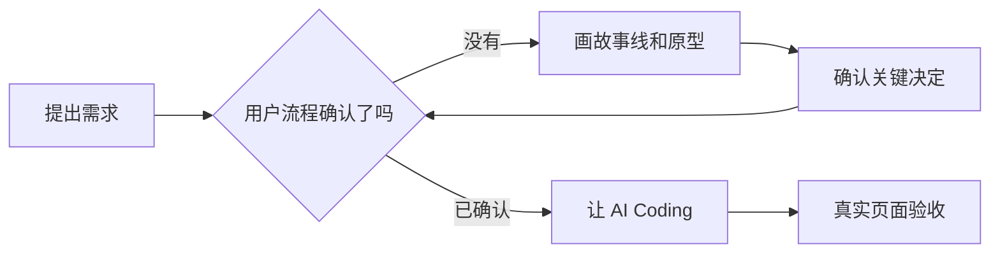

# AC-001｜复杂功能先画用户流程，再让 AI 写代码

> [!tip] 一句话经验
> AI 最擅长执行已经想清楚的方案，不擅长替我决定业务应该怎样运行。

## 一眼看懂

## 这次发生了什么

- #178 开发后才确认“评级保存”和“生成任务”必须分开。
- AI 曾按错误默认项实现“默认 Q1/月 1”，之后必须纠正。
- 看到真实页面后，又重新设计年月选择、计划草稿和 Buddy 流程。

## 为什么会这样

Issue 说明了很多后台规则，但没有先把用户每一步怎么操作画清楚。没有明确的地方，AI 就会使用默认值、旧代码或自己的推测补齐。

## 以后怎么做

1. 跨页面或跨角色需求，先画一条用户操作流程。
2. 把“还没决定的问题”单独列出，不允许 AI 自己选择。
3. 关键页面原型确认后，才进入 Coding。

## 我的真实案例

- [Issue #178](https://github.com/yinhui198456/team-capability-platform/issues/178)
- [PR #179](https://github.com/yinhui198456/team-capability-platform/pull/179)
- 对话中的故事线、年月选择器和计划草稿确认过程。

## 对应能力

- **需求能力：我有没有先把事情想清楚。**
- **AI 管理能力：我有没有阻止 Agent 擅自补业务决定。**
- **系统设计能力：我是否理解不同页面和角色怎样形成完整流程。**

**当前状态：🔵 重复出现**

> [!note]- 详细说明：外部能力标尺与面试素材
>
> - 腾讯 CodeBuddy 的 Plan Mode 把需求澄清、方案确认、任务拆解放在执行前：[官方资料](https://www.codebuddy.cn/docs/ide/Features/Plan-Mode)。
> - GitHub Spec Kit 使用 `Spec → Plan → Tasks → Implement`，强调先定义场景和预期结果：[官方项目](https://github.com/github/spec-kit)。
> - **推导演练题，非真实面试题：**请讲一次需求看起来很详细，但 Agent 实现后仍大量返工的经历。你后来怎样识别“规格完整”和“文字很多”的区别？
> - **我的回答素材：**#178 的默认 Q1/月 1、评级与任务未解耦，以及后来通过故事线和原型重新锁定业务。
