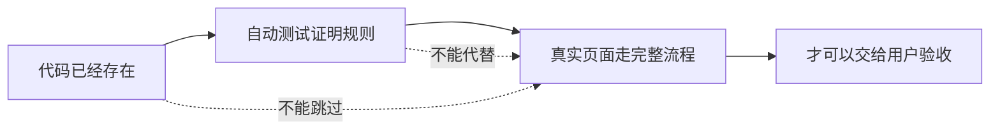

# AC-002｜代码写出来、测试通过、用户能用，是三件事

> [!tip] 一句话经验
> AI 说“完成”只能说明它停止工作了，不能证明用户真的可以使用。

## 一眼看懂

## 这次发生了什么

- #178 多次报告目标测试通过，独立审查仍发现真实调用和旧接口缺口。
- #181 同时完成专项测试、隔离浏览器检查和真实 Chrome 操作。
- 全量检查有历史失败时，开始区分“本次新增问题”和“以前已有问题”。

## 为什么会这样

每种证据只能证明一部分：代码证明“写了”，测试证明“某个规则成立”，真实页面才证明“用户可以完成目标”。

## 以后怎么做

1. 每条验收规则同时指定自动测试和真实页面步骤。
2. 不接受 Agent 自报完成作为最终证据。
3. 测试失败先判断属于产品、测试还是环境，不立即改代码。

## 我的真实案例

- [Issue #181](https://github.com/yinhui198456/team-capability-platform/issues/181)
- [PR #182](https://github.com/yinhui198456/team-capability-platform/pull/182)
- [Issue #183：历史失败基线](https://github.com/yinhui198456/team-capability-platform/issues/183)

## 对应能力

- **验证能力：我能否判断 AI 的输出到底证明了什么。**
- **交付能力：我能否从代码一直验证到用户真正可用。**
- **判断能力：我是否会被“全绿”或“全红”误导。**

**当前状态：🟢 已验证有效**

> [!note]- 详细说明：外部能力标尺与面试素材
>
> - 腾讯 CodeBuddy 把工程理解、单元测试和智能评审纳入 AI Coding 工具链：[官方资料](https://cloud.tencent.com/product/acc)。
> - 华为公开岗位强调完整软件开发过程、代码可信、构建和发布：[官方招聘](https://career.huawei.com/reccampportal/globle/huawei-special-recruitment.html)。
> - **推导演练题，非真实面试题：**一个 AI 生成的功能专项测试通过，但全量检查失败。你怎样判断它是否可验收？
> - **我的回答素材：**#181/#182 的专项测试和真实 Chrome 通过，同时把既有失败单独归入 #183。
