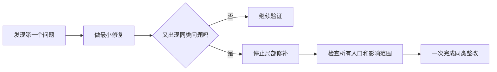

# AC-003｜同类问题第二次出现，就停止逐个打补丁

> [!tip] 一句话经验
> 连续发现同一类问题时，应该停下来检查整条流程，而不是继续让 AI 一处一处修。

## 一眼看懂

## 这次发生了什么

#178 先后暴露：重复请求和同时提交处理不完整、前后端关键参数没有接通、旧提交接口仍能恢复已经废弃的 Buddy 流程。

## 为什么会这样

每次只修眼前失败，只会检查新路径，很容易漏掉旧接口、其他调用者和失败路径。这些其实属于同一个业务规则切换不完整的问题。

## 以后怎么做

1. 第二个同类问题出现时，立即停止继续打补丁。
2. 一次检查文档、接口、前端、后台、旧入口、失败路径和测试。
3. 修复前先确认“旧行为是否还可能被触发”。

## 我的真实案例

- [Issue #178](https://github.com/yinhui198456/team-capability-platform/issues/178)
- [PR #179](https://github.com/yinhui198456/team-capability-platform/pull/179)

## 对应能力

- **系统思考能力：我能否看出几个 Bug 其实来自同一个根因。**
- **审查能力：我能否检查 AI 没有主动修改的旧入口。**
- **效率能力：我能否减少反复测试和重复提交。**

**当前状态：🔵 重复出现**

> [!note]- 详细说明：技术知识、外部标尺与面试素材
> 当前只需学到“能看懂并判断”：
>
> - 整批要么全部成功，要么全部失败（专业名称：事务原子性 / Transaction Atomicity）。
> - 同一次操作重复发送，不能创建两份任务（专业名称：幂等性 / Idempotency）。
> - 防止两次修改基于旧内容互相覆盖（专业名称：乐观并发控制 / Optimistic Concurrency）。
> - 旧接口不能恢复废弃流程（专业名称：接口退役 / API Retirement）。
>
> 阿里/Qwen Code 的审查流程明确包含需求符合度、旧行为检查和跨文件调用追踪：[官方 GitHub 资料](https://github.com/QwenLM/qwen-code/blob/main/docs/users/features/code-review.md)。
>
> **推导演练题，非真实面试题：**新接口测试通过，但旧接口仍能恢复废弃流程，你会怎样系统审查？
>
> **我的回答素材：**#178 从增量生成、重复提交和版本更新，一直到最后发现旧 submit 接口仍创建复核流程。
