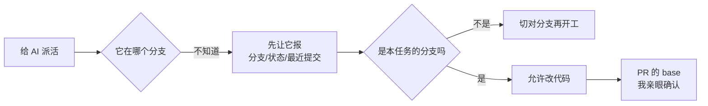

# AC-004｜AI 改代码前，先确认在哪个分支

> [!tip] 一句话经验
> Agent 只会继承"当前所在分支"，不会主动问"这次该在哪个宇宙改"——分支确认永远是我的责任。

**当前状态：📝 AI 草稿**（手写区完成前不升级）

## 一眼看懂

## 这次发生了什么（AI 提取）

- TCP PR #179 的 base 是 `fix/issue-93-responsive-layout`（另一条未合并分支）而不是 master，形成堆叠；#187 不得不专门写明"不得把其 PR body 或分支实现当作 master 现状"。
- TCP 仓库积压 42 条分支，大量已闭环 Issue 的分支未删，"哪个分支才是现状"本身成了问题。
- 作者实测反馈：AI Coding 过程中分支、Worktree 相关错误反复出现。

## 为什么会这样（AI 起草）

每个 Agent 会话启动时继承的是启动目录的分支状态，它默认"当前分支就是要干活的地方"。并行会话一多，每个会话都以为自己的分支就是真相；分支一多，连人也说不清 master 现状。

## ✍️ 我的复述（手写）

（手写区，AI 不许填）

## ✍️ 我的复核记录（手写）

（手写区：日期 + 我亲手做了什么验证。完成后状态才能改 🔵）

## 以后怎么做

1. 派活前让 Agent 先报 `git branch --show-current`、`git status`、`git log --oneline -3`，不对就先切分支。
2. PR 的 base 是不是 master，我亲眼确认；是堆叠就要能说出为什么。
3. PR 合并后立即删分支；每周复盘扫一次分支列表。

## 我的真实案例

- [PR #179：base 为非 master 的堆叠分支](https://github.com/yinhui198456/team-capability-platform/pull/179)
- [Issue #187：明确警告分支现状 ≠ master 现状](https://github.com/yinhui198456/team-capability-platform/issues/187)
- [Issue #55：多 Worktree 环境隔离](https://github.com/yinhui198456/team-capability-platform/issues/55)
- [Issue #176 评论（2026-08-17）](https://github.com/yinhui198456/team-capability-platform/issues/176#issuecomment-5312115520)：主控与写入者未分离 + 复用历史目录名，第一轮改动误写进长期测试环境；详见 [[cases/issue-176-任务详情首屏信息架构|案例 #176]]

## 对应能力

- **AI 管理能力：我有没有在派活前确认 Agent 的工作位置。**
- **工程卫生能力：分支是否随合并及时清理。**

> [!note]- 详细说明
> 配套的基础命令和分支纪律见 [[foundations/git-basics|Git 基础 · 小白操作规范与命令]]。
