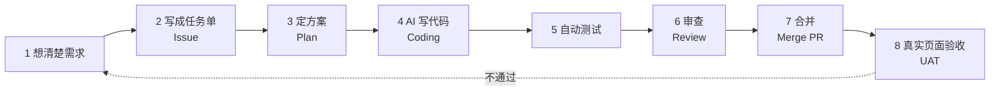

# AI Coding 基本流程 · 从想法到能用

> [!tip] 一句话
> AI Coding 不是"说一句需求 → 拿到软件"，而是一条流水线；AI 只在其中几站干活，**想清楚和验明白这两站永远是我的**。

## 一眼看懂

## 每站干什么、谁负责

| 站 | 干什么 | 谁负责 | 我踩过的坑 |
| --- | --- | --- | --- |
| 1 想清楚需求 | 画出用户从哪来、点什么、看到什么、失败怎么办 | **我** | [[AC-001-复杂功能先画用户流程\|AC-001]]：跳过这站，AI 替我乱选默认值 |
| 2 写 Issue | 把需求写成任务单：目标、规则、验收标准 | **我** | Issue 字很多 ≠ 流程想清楚了 |
| 3 定方案 | 拆步骤、选做法、列出"还没决定的问题" | 我 + AI 起草 | 未决定的问题不允许 AI 自己选 |
| 4 Coding | 按方案写代码 | **AI**（一个写入者） | 其他 Agent 只能只读审查 |
| 5 自动测试 | 跑测试证明每条规则成立 | AI 写、AI 跑 | [[AC-002-代码测试与真实可用\|AC-002]]：测试过 ≠ 能用 |
| 6 Review | 检查逻辑、旧入口、漏网路径 | 独立审查者 | [[AC-003-第二个同类问题后停止打补丁\|AC-003]]：审查发现了写入者没碰的旧接口 |
| 7 Merge | 通过后合并进主线 | 我确认 | — |
| 8 UAT | 真实页面走完整流程 | **我/用户** | 这是唯一算数的终点 |

## 三条死规矩（从坑里长出来的）

1. **第 1 站没完成，不许进第 4 站。** 复杂需求先画用户流程图。
2. **第 5 站绿了，不许跳第 8 站。** 代码存在、测试通过、用户能用是三件事。
3. **同一类问题在第 6~8 站出现第二次，退回第 3 站重新查整条链。**

## 我目前的位置

- 第 4~6 站（AI 干活区）：已经开始分层管理，有进步。
- 第 1~3 站（想清楚区）：**当前最大短板**，也是 [[capability-map/index|能力地图]] 里唯一刻意练习项。
- 第 8 站（验收）：进步最快，已坚持真实页面证据。

> [!note]- 详细说明：这套流程对应的外部叫法
>
> - 行业里把 1→3 叫 **Spec/Plan 阶段**，4→7 叫 **Implement 阶段**，8 叫 **Acceptance**。
> - GitHub Spec Kit 的 `Spec → Plan → Tasks → Implement` 就是上图的正式版：[官方项目](https://github.com/github/spec-kit)。
> - 腾讯 CodeBuddy 的 Plan Mode 同样把澄清和确认放在执行前：[官方资料](https://www.codebuddy.cn/docs/ide/Features/Plan-Mode)。
> - 结论：我的流程方向和大厂工具一致，问题不在流程缺失，而在第 1 站执行不彻底。
