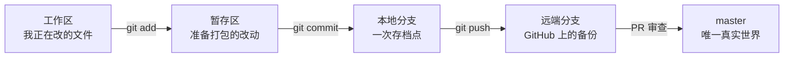

# Git 基础 · 小白操作规范与命令

> [!tip] 一句话
> Git 是代码的时光机 + 平行宇宙管理器：每条分支是一个平行宇宙，master 是唯一"真实世界"。AI Coding 最常犯的错，就是在错误的宇宙里改了代码。

## 一眼看懂：代码的旅程

## 开工三步确认（防呆第一守则）

**每次让 AI 开工前，先让它报告这三项；自己也看得懂：**

| 命令 | 回答的问题 | 期望答案 |
| --- | --- | --- |
| `git branch --show-current` | 我在哪个分支？ | 是本任务专属分支，**不是 master，也不是别的 Issue 的分支** |
| `git status` | 有没有没存档的改动？ | `nothing to commit, working tree clean` |
| `git log --oneline -3` | 最近三次存档是什么？ | 是本任务的提交，没有别人的东西混进来 |

## 最小命令集（先掌握这 12 个）

| 命令 | 人话 | 危险度 |
| --- | --- | --- |
| `git clone <地址>` | 把整个仓库复制到本机 | ✅ 安全 |
| `git status` | 现在什么状态 | ✅ 安全，随便按 |
| `git branch --show-current` | 我在哪个分支 | ✅ 安全 |
| `git switch -c fix/issue-xxx-名字` | 从当前位置开一个新平行宇宙并跳过去 | ✅ 安全 |
| `git switch master` | 跳回真实世界 | ⚠️ 有未提交改动时会拦你或带过去 |
| `git add -A` | 把所有改动放进打包区 | ✅ 安全 |
| `git commit -m "说明"` | 存档一次，写清**为什么**改 | ✅ 安全 |
| `git push -u origin 分支名` | 第一次把本地分支传上 GitHub | ✅ 安全 |
| `git pull` | 把远端新内容拉回本地 | ⚠️ 可能有冲突，冲突了停下来问 |
| `git log --oneline -10` | 看最近 10 次存档 | ✅ 安全 |
| `git diff` | 看还没存档的改动细节 | ✅ 安全 |
| `git branch -d 分支名` | 删掉已合并的分支 | ⚠️ 删错未合并分支会丢工作 |

> [!danger] 小白红线：这三类命令，AI 提出时必须人工确认
> - `git push --force`（强制覆盖远端历史，可能毁掉别人的工作）
> - `git reset --hard` / `git checkout -- .`（丢弃本地改动，不可恢复）
> - `git rebase`（改写历史；还没理解前，统一用 `git merge` / `git pull`）

## 分支纪律（TCP 实测约定）

1. **一个 Issue 一条分支**，命名带类型和编号：`fix/issue-178-xxx`、`feat/xxx`、`chore/xxx`、`docs/xxx`；
2. **从最新 master 切**：`git switch master && git pull && git switch -c 新分支`；
3. **PR 合并后立即删分支**，本地远端都删；
4. 每周复盘时扫一眼分支列表，已闭环 Issue 的分支清掉。

反例就在 TCP：仓库积了 **42 条分支**，大量已闭环 Issue 的 `feat/`、`fix/`、`release/` 分支没删，导致"哪个分支才是现状"本身成了问题。

## 配套工具：gh（GitHub CLI）

`git` 管代码历史，`gh` 管 GitHub 平台上的协作：Issue、PR、CI 运行状态。AI Coding 里 Agent 经常要用它读 Issue、开 PR、核对"PR 合并后 Issue 关了没"（TCP #185 的交付终态清单全靠它）。

| 命令 | 人话 |
| --- | --- |
| `gh issue list` | 看任务单列表 |
| `gh pr status` / `gh pr checks` | 看我的 PR 状态 / CI 过没过 |
| `gh pr create` | 开一张合并申请单 |
| `gh repo view --web` | 在浏览器打开当前仓库 |

安装（Windows）：`winget install GitHub.cli`，装完 `gh auth login` 登录一次即可。没装它的替代方案是 `curl` 直接调 GitHub API，麻烦但可行。

## Worktree 是什么

同一仓库同时开出**多个工作目录**，各占一条分支，互不干扰——多 Agent 并行开发时必须用它（TCP #55 就是为此做的环境隔离）。

- `git worktree add ../tcp-issue-50 fix/issue-50-xxx`：在隔壁目录开一个新工位
- 每个 Agent 只在自己的 worktree 里干活，天然满足"一个写入者"

## AI Coding 专属风险

分支问题是 AI 协作里最高发的混乱来源，已单独成卡：[[AC-004-AI改代码前先确认分支|AC-004 · AI 改代码前先确认分支]]。

> [!note]- 详细说明：进阶概念（遇到了再回来看）
>
> - **merge vs rebase**：merge 是"两条宇宙汇合，保留全部历史"；rebase 是"把我的改动搬到对方最新点重放，历史更干净但会改写提交编号"。小白阶段统一用 merge。
> - **detached HEAD**："没站在任何分支上"的悬空状态，此时提交容易丢。遇到就 `git switch -c 临时分支名` 先给它安个家。
> - **origin vs upstream**：origin 是你自己的远端仓库；upstream 是你 fork 来源的官方仓库（本知识库就把 Quartz 官方设为 upstream 只读源）。
> - **Stacked PR（堆叠 PR）**：PR 的 base 不是 master 而是另一条未合并分支。链条一长就没人说得清 master 现状——TCP PR #179 就是活例，base 是 `fix/issue-93-responsive-layout` 而非 master，#187 不得不专门警告"不得把其分支实现当作 master 现状"。
