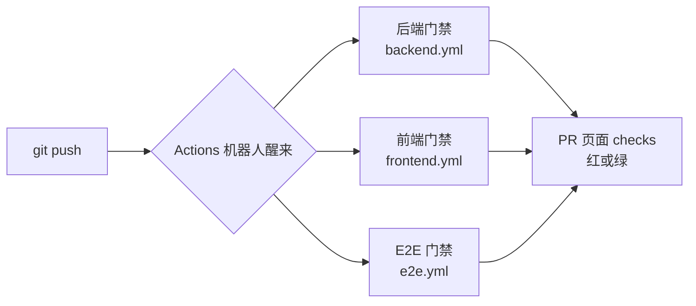

# GitHub Actions 扫盲（CI 门禁）

> [!important] 本页怎么填写（浏览器里就能写）
> 点 → [✏️ 编辑本页](https://github.com/yinhui198456/ai-coding-playbook/edit/v5/content/foundations/github-actions.md) → 搜「✍️」→ 写在横线上 → **Commit changes** 保存，1~2 分钟自动更新。

**当前状态：📝 AI 草稿**（手写区完成前不许改状态）

## 一句话说人话

**Actions 是 GitHub 送的机器人：每次 push 代码，它自动在干净的服务器上把项目装起来、跑检查、跑测试，成绩单贴在 PR 上。** 不用人点，push 就触发。

## 它在 TCP 里长什么样（#194 实战）

TCP 的 [.github/workflows/](https://github.com/yinhui198456/team-capability-platform/tree/master/.github/workflows) 下三个文件，对应三道门禁：

| 文件 | 门禁名 | 干什么 | 相当于 |
| --- | --- | --- | --- |
| `backend.yml` | Backend Quality Gate | 装后端环境 → ruff/black 风格检查 → pytest 全套 | 后端代码的"体检" |
| `frontend.yml` | Frontend Quality Gate | 装前端环境 → eslint → Vitest → 构建 | 前端代码的"体检" |
| `e2e.yml` | E2E Tests | 起真实浏览器，模拟用户点页面 | "模拟真人"的体检 |

你在 [Actions 页](https://github.com/yinhui198456/team-capability-platform/actions)看到的每一条记录，就是一次 push 触发的其中一道门禁。点进去能看每一步的日志——**红了就点进去看日志，先区分"新失败"还是"已知尾巴"**。

## 最容易混的三件事

| | 谁跑 | 在哪跑 | 算数吗 |
| --- | --- | --- | --- |
| AI 自报测试 | AI 自己 | 开发机 | 参考（可能"我机器上能过"） |
| **CI / Actions** | GitHub 机器人 | 干净服务器 | **硬证据**，PR 能不能合并看它 |
| UAT（真人验收） | 你 | 测试环境真实浏览器 | 最终证据 |

#194 案例里三者齐全：AI 自报 749 passed（站 5）→ CI 独立复跑（站 6 checks）→ 等你真人验收（站 8）。

## ✍️ 我的复述（手写）

合上页面，用自己的话写：Actions 是什么？为什么 AI 说"测试全过"还不够？

（手写区，AI 不许填）

## ✍️ 我的案例（手写）

我在 TCP 亲眼见过它的哪个瞬间？（提示：#194 的 E2E 门禁为什么一直红？）

（手写区，AI 不许填）
