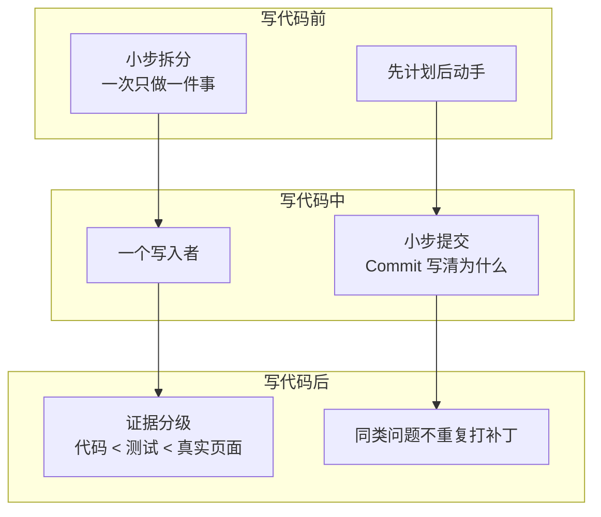

# 通行规范与好习惯 · 人话版

> [!tip] 一句话
> 规范不是繁文缛节，是别人踩过的坑提前画好的护栏。这一页区分两件事：**行业常识**（还没亲自验证）和**已验证**（我的项目里真救过我）。

## 一眼看懂

## 规范清单

| 规范 | 人话解释 | 状态 |
| --- | --- | --- |
| 一次只做一件事 | 一个 Issue / 一个 PR 只解决一个问题，改小了才好查、好退 | 🟢 已验证：[[AC-002-代码测试与真实可用\|#181]] 范围明确，一次验收通过 |
| 先计划后动手 | 复杂需求先出方案再写代码，方案里列清"未决定项" | 🔵 学习中：[[AC-001-复杂功能先画用户流程\|AC-001]]，下一次刻意练习 |
| 一个写入者 | 同一时刻只让一个 Agent 改代码，其余角色只读 | 🟢 已验证：[[retrospectives/2026-08-16-TCP-AI-Coding阶段复盘\|阶段复盘]] 第 4 条 |
| 小步提交 | 每完成一个小点就提交一次，说明写"为什么改"而不是"改了什么" | ⚪ 行业常识，待验证 |
| 证据分级 | Agent 说完成 < 测试通过 < 真实页面走完，只信最高级证据 | 🟢 已验证：[[AC-002-代码测试与真实可用\|AC-002]] |
| 同类问题第二次出现就停手 | 不继续打补丁，回头扫整条业务链 | 🔵 重复出现：[[AC-003-第二个同类问题后停止打补丁\|AC-003]]，待再验证 |
| 失败先归类再动手 | 测试失败先判断是产品错、测试错还是环境错，不直接改代码 | 🟢 已验证：[[AC-002-代码测试与真实可用\|AC-002]] 第 3 条 |
| 分支保护 | 主线不直接改，都走分支 + PR + 审查 | ⚪ 行业常识，待验证 |

## 状态图例

- 🟢 **已验证**：真实项目里正反案例都经历过，可以依赖。
- 🔵 **重复出现**：坑踩过不止一次，方法还没完整跑通一轮。
- ⚪ **行业常识**：还没亲自验证，先按它做，踩到坑就升级成经验卡。

> [!note]- 详细说明：规范的晋升路径
>
> 本页是"规范候选池"。⚪ 的规范在真实项目验证后转 🟢，并生成对应经验卡；🟢 积累多条且稳定后，才考虑沉淀到 [[methodology/index|个人方法论]] 或 [[sop/index|SOP]]。
> 这样本页和经验卡、方法论之间就形成了一条完整链路：**行业常识 → 亲自验证 → 经验卡 → 方法论**。
