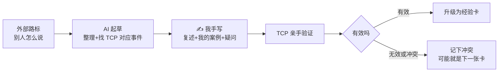

# 学习区 · 外部经验转化管道

> [!tip] 一句话
> 看别人的经验只是"知道"，亲手写一遍、在项目里试一次才是"学会"。本区存在的唯一目的：把外部经验变成我自己的判断。

## 转化管道

## 状态定义（全库通用）

| 状态 | 含义 | 谁能打这个标 |
| --- | --- | --- |
| 📝 AI 草稿 | AI 整理的初稿，手写区为空 | AI |
| 🔵 我已复核 | 手写区已由我本人填写 | **只有我** |
| 🟢 项目已验证 | 在 TCP 里亲手跑过，有效 | 我 + 证据链接 |
| 🔴 被证伪 | 验证发现不成立，保留作教训 | 我 + 证据链接 |

> [!warning] 铁律
> - AI 可以：起草、整理外部资料、找 TCP 里的对应事件、提问题。
> - AI 不可以：填写 ✍️ 手写区、把 📝 改成 🔵。
> - **手写区为空的页面，永远停在 📝，不算学会。**

## 学习主题队列

从外部路标和 TCP 历程映射出的待学主题，复盘时逐个认领：

| # | 主题 | 外部路标 | TCP 对应事件 | 状态 |
| --- | --- | --- | --- | --- |
| 1 | 上下文与规则文件（CLAUDE.md / AGENTS.md 分层） | vibe-coding-cn · concepts | PR #76、#180 | ⚪ 未开始 |
| 2 | 需求先行：Spec / Plan 工作流 | vibe-coding-cn · workflow；GitHub Spec Kit | AC-001、#57、#187 | ⚪ 未开始 |
| 3 | 测试金字塔与证据分级 | vibe-coding-cn · concepts | AC-002、#1~#6 Playwright 系列 | ⚪ 未开始 |
| 4 | 原子性、幂等性与并发 | 鱼皮 ai-guide · 70 概念大全 | AC-003、#82 | ⚪ 未开始 |
| 5 | 状态机设计 | 鱼皮 ai-guide · 70 概念大全 | UAT 缺陷群 #113/#118/#144/#145/#147 | ⚪ 未开始 |
| 6 | URL 与前端状态管理 | — | UAT 缺陷群 #132/#133/#134/#142/#149/#161 | ⚪ 未开始 |
| 7 | 权限与多角色边界 | — | #96、#117、#122、PR #167 | ⚪ 未开始 |
| 8 | CI 门禁与 Stacked PR | vibe-coding-cn · workflow | PR #78 | ⚪ 未开始 |
| 9 | 开发环境隔离（Worktree / Docker） | — | #55、#184 | ⚪ 未开始 |
| 10 | 仓库安全基线 | — | PR #77 | ⚪ 未开始 |
| 11 | 交付终态与每周复盘机制 | — | #185（本知识库的机制来源） | ⚪ 未开始 |
| 12 | Git 分支与 Worktree 纪律 | — | AC-004、PR #179 堆叠、42 分支堆积 | ⚪ 未开始 |

## 怎么用这个队列

1. 每次复盘时挑 1 个主题，复制 [[templates/learning-note|学习笔记模板]] 建页；
2. AI 起草「外部说法」和「TCP 对应事件」两节；
3. **我手写**：复述、我的案例、我还没懂的；
4. 在下一个 TCP 任务里亲手验证，回来改状态；
5. 验证有效的，按 [[templates/experience-card|经验卡模板]] 升级为经验卡。

外部资料入口：[[learning/external-resources|外部路标]]。
