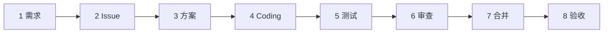

# Issue #xxx｜一句人话标题

> [!important] 本页怎么填写
> 网页只读，**动笔请改源文件**：用编辑器打开本页对应的 `.md` 文件，搜索「✍️ 待我」，把答案写在 `＿＿＿` 横线处。

**Issue**：（链接）｜ **当前站**：x/8

> 图例：✅ 已完成（有证据）｜ ✍️ **等我来填**（附采集步骤）｜ ⬜ 还没到

## ✍️ 我要填的汇总

| 站 | 要填什么 | 采集方式 |
| --- | --- | --- |
| 1 | 业务确认 | 走一遍真实页面，对照 Issue 期望 |
| 3 | 未决定问题清单 | 问 AI："你替我做了哪些假设？" |
| 7 | PR base 亲眼确认 | 打开 PR 页面看 base 栏 |
| 8 | 验收逐条打勾 | 真实浏览器对照验收标准 |

## 各站记录

### 站 1 · 需求

（AI 整理：对照"要做什么 / 不做什么 / 成功标准"三件套检查需求是否齐全。**涉及前端必附原型图**：截图或链接。）

> [!todo] ✍️ 待我确认：业务理解一致
> 1. 先看原型图，再打开真实页面走一遍主流程；
> 2. 对照 Issue 的期望结果；
> 3. 不一致就先改 Issue，不进入 Coding。
>
> 我的确认（日期 + 方式）：＿＿＿＿＿＿

### 站 2 · Issue 任务单

（AI 整理：类型/优先级、不改什么、同族 Issue。各一行。）

**验收标准必须转成可操作检查单**，每条配"怎么操作"：

| # | 验收点 | 怎么操作 | 结果 |
| --- | --- | --- | --- |
| 1 | （原文） | （具体动作，谁看了都会做） | ⬜ |

### 站 3 · 方案

（AI 收集：方案原文引用 + commit/文档链接。若已开始 Coding，从提交说明里还原方案。）

> [!todo] ✍️ 待我逐条确认：AI 替我做的假设
> 问 AI："这个方案里你替我做了哪些假设？逐条列出"，列成表逐条标"同意/改成什么"。
> 没确认完不许继续 Coding。

### 站 4 · Coding

（AI 整理：分支/worktree、开工三步确认结果、纠错事件。）

### 站 5 · 测试

> [!todo] ✍️ 待我核对：测试证据
> 1. 让 AI 列出跑了哪些测试、结果截图/链接；
> 2. 追问："全量测试里哪些是历史失败、哪些是这次新增的？"（对照 #183 基线）

### 站 6 · 审查

> [!todo] ✍️ 待我派单：独立审查
> 1. 派一个只读 Agent 审查，要求专门检查本 Issue 声明"不改"的东西有没有被动；
> 2. 记录发现和结论链接。

### 站 7 · 合并

> [!todo] ✍️ 待我确认：base 与终态
> 1. 打开 PR 页面，亲眼看 base 一栏是 master（或是能说出理由的堆叠）；
> 2. 按 TCP #185 七项核对：PR 状态 / Issue 评论 / 关闭原因 / Project / 计划状态 / 监控清理 / 用户说明。

### 站 8 · 验收

> [!todo] ✍️ 待我验收：真实页面
> 1. 真实浏览器打开页面（记录尺寸）；
> 2. 对照站 2 的验收标准逐条打勾；
> 3. 截图存到 UAT 反馈，**不含凭据**。

## ✍️ 我的复盘（手写）

- 印证了哪张经验卡：
- 新候选卡：
