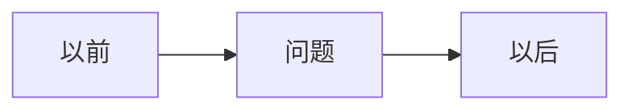

# AC-xxx｜一句人话标题

> [!important] 本页怎么填写
> 网页只读，动笔请改源文件：编辑器打开本页 `.md` 文件，找到「✍️」小节手写。

> [!tip] 一句话经验
> 这次我到底学会了什么？

**当前状态：📝 AI 草稿**

状态流转：📝 AI 草稿 → 🔵 我已复核（手写区完成）→ 🟢 项目已验证 / 🔴 被证伪。
🟢 且重复验证后才可晋升 [[methodology/index|方法论]]。

## 一眼看懂

## 这次发生了什么（AI 提取）

- 最多三条事实，附证据链接。

## 为什么会这样（AI 起草）

先说人话；必要时再补专业名称。

## ✍️ 我的复述（手写）

合上卡片，用自己的话写：为什么以前会犯、以后怎么避免。写不顺 = 还没真懂。

（手写区，AI 不许填）

## ✍️ 我的复核记录（手写）

日期 + 我亲手做了什么来确认这条经验（重读对话？跑了哪个页面？试了哪个操作？）。

（手写区，AI 不许填；完成本节后才能把状态改为 🔵）

## 以后怎么做

1. 只给一到三个动作。

## 我的真实案例

- Issue / PR / UAT。

## 对应能力

- **能力名称：人话解释。**

> [!note]- 详细说明
> 技术原理、外部资料和面试素材放在这里。
