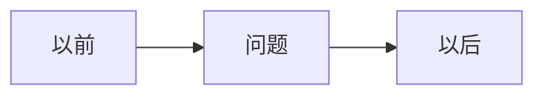

# AC-xxx｜一句人话标题

> [!tip] 一句话经验
> 这次我到底学会了什么？

## 一眼看懂

## 这次发生了什么

- 最多三条事实。

## 为什么会这样

先说人话；必要时再补专业名称。

## 以后怎么做

1. 只给一到三个动作。

## 我的真实案例

- Issue / PR / UAT。

## 对应能力

- **能力名称：人话解释。**

**当前状态：🟡 刚发现**

> [!note]- 详细说明
> 技术原理、外部资料和面试素材放在这里。
